<p align="center">
  
</p>

<p align="center">
  <a href="https://www.npmjs.com/package/weather-outlook"></a>
  <a href="https://github.com/cport1/weather-outlook/actions/workflows/ci.yml"></a>
  
  
  <a href="LICENSE"></a>
</p>

<p align="center">
  <b>Forecasts, animated radar, live hurricane tracks, wildfires, earthquakes, alerts and space weather —<br>
  in a full-screen terminal dashboard that runs anywhere and needs zero API keys.</b>
</p>

<p align="center">
  
</p>

---

## ⚡ Quick start

```sh
bunx weather-outlook@next              # try it instantly
bunx weather-outlook@next "Tokyo"      # any city, postcode, or "lat,lon"
```

Or install it globally:

```sh
npm i -g weather-outlook@next          # or: bun add -g weather-outlook@next
weather-outlook                        # dashboard for wherever you are (IP location)
wo Denver --once                       # short alias + one-shot summary
```

> [!NOTE]
> v2 is in alpha on the `next` tag and runs on [Bun](https://bun.sh) (the TUI engine needs Bun's FFI).
> If Bun isn't installed, the `weather-outlook` command tells you how to get it.
> Standalone binaries that need nothing at all (macOS, Linux glibc/musl, Windows) are attached to each
> [GitHub release](https://github.com/cport1/weather-outlook/releases) with SHA256 checksums.

## ✨ What's inside

<table>
  <tr>
    <td width="50%" valign="top">
      <h3>☔ Now — a living sky</h3>
      Particle rain, snow, fog, twinkling stars and lightning that follow the <i>real</i> conditions (wind slants the rain). Big temperature, feels-like, wind, humidity, pressure, UV, AQI, sun & moon.
      <br><br>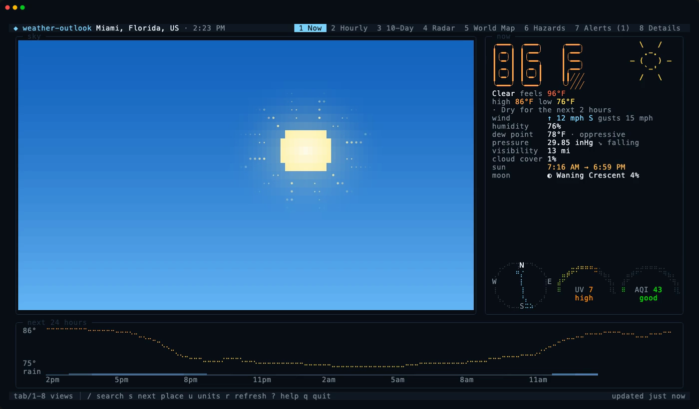
    </td>
    <td width="50%" valign="top">
      <h3>📡 Radar — the last two hours, looping</h3>
      13 RainViewer frames animated over a coastline map, with play/pause and frame stepping. Kitty / Sixel terminals get <b>real pixels</b>; everyone else gets crisp half-block cells.
      <br><br>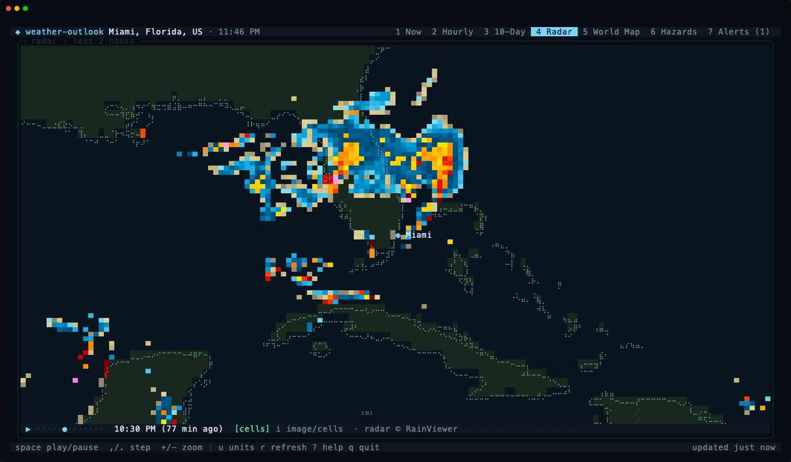
    </td>
  </tr>
  <tr>
    <td width="50%" valign="top">
      <h3>🌍 World Map — the planet, live</h3>
      Braille coastlines over a half-block globe with hurricane tracks & forecast cones (spinning, by category), US wildfires, thousands of satellite fire hotspots, pulsing earthquakes and alert polygons. Pan, zoom, toggle layers.
      <br><br>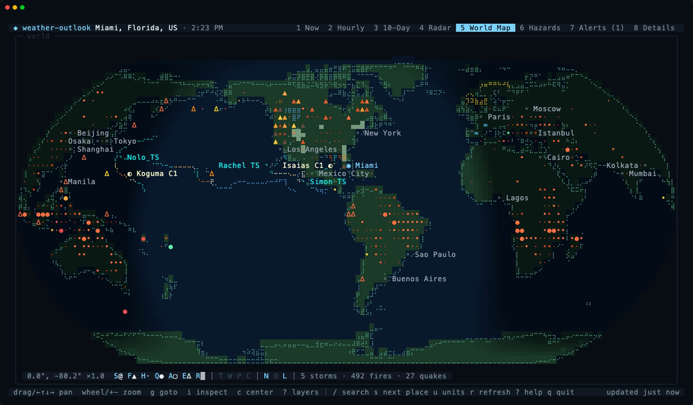
    </td>
    <td width="50%" valign="top">
      <h3>🌀 Hazards — what's going wrong, everywhere</h3>
      Active tropical cyclones with intensity sparklines (past → forecast), the largest wildfires with containment, the strongest quakes with distance from you, and a Kp-based "can I see the aurora tonight?" verdict.
      <br><br>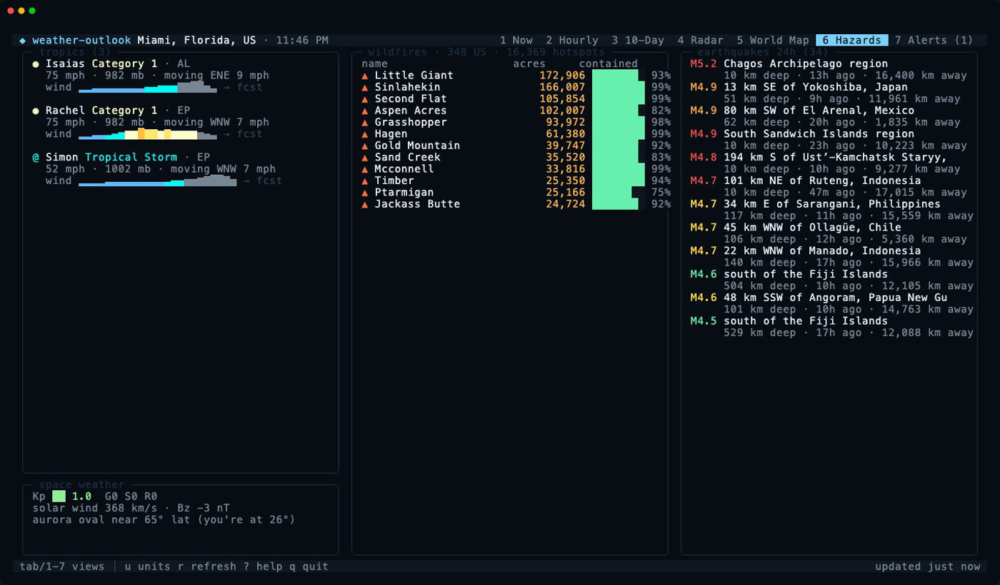
    </td>
  </tr>
  <tr>
    <td width="50%" valign="top">
      <h3>🕐 Hourly — the next 48 hours</h3>
      Temperature and feels-like colored on a heat scale, rain probability bars, precipitation, wind with direction arrows, humidity.
      <br><br>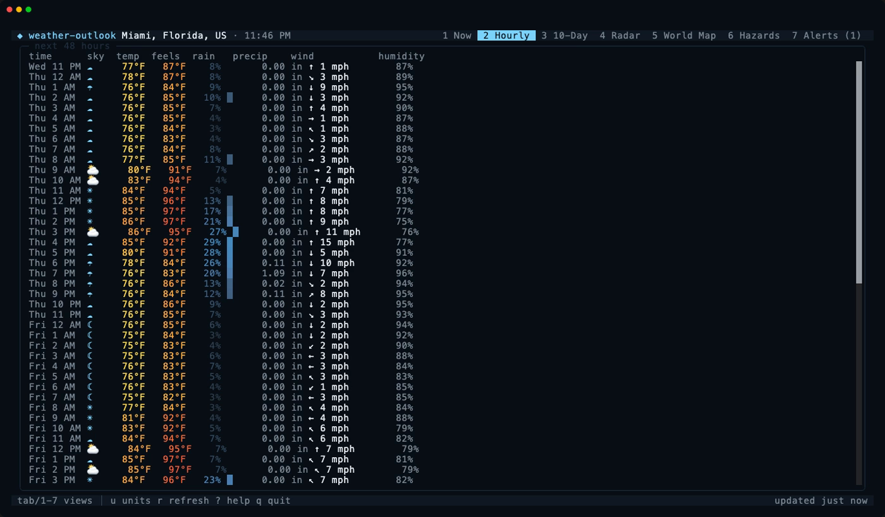
    </td>
    <td width="50%" valign="top">
      <h3>📅 10-Day — ranges at a glance</h3>
      Every day's low→high drawn as a gradient bar on one shared scale, so warm-ups and cold snaps jump out.
      <br><br>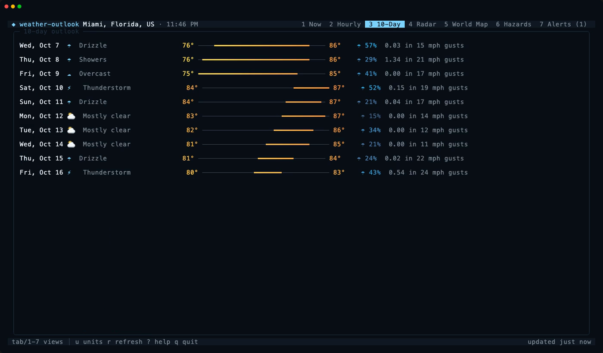
    </td>
  </tr>
  <tr>
    <td width="50%" valign="top">
      <h3>⚠️ Alerts — official warnings</h3>
      Active NWS alerts for your location, sorted by severity, with the full text and safety instructions.
      <br><br>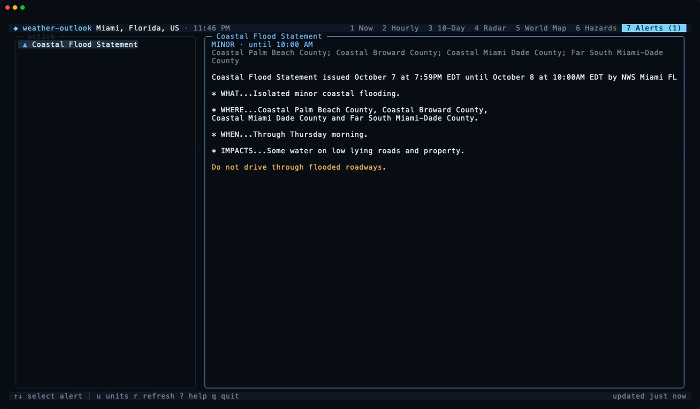
    </td>
    <td width="50%" valign="top">
      <h3>⌨️ Keyboard-first</h3>
      Seven views on <kbd>1</kbd>–<kbd>7</kbd>, vim-style map panning, <kbd>?</kbd> for help anywhere, auto-refresh every 10 minutes, and it respects <code>NO_COLOR</code> and reduced motion.
      <br><br>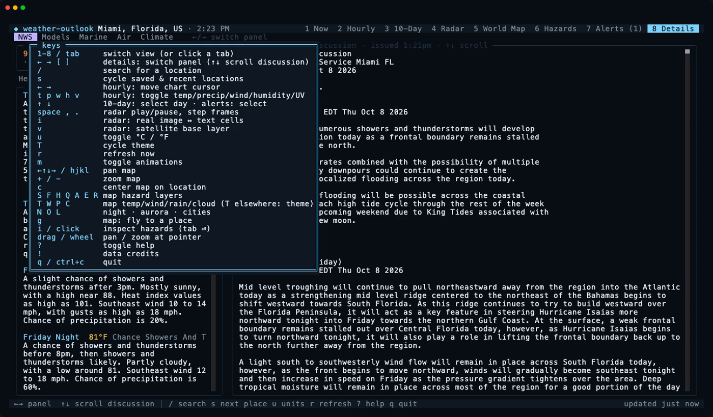
    </td>
  </tr>
</table>

## 🖨️ One-shot mode

Not every moment needs a dashboard. `--once` prints a summary and exits — it's also what you get automatically when piping:

```sh
weather-outlook Denver --once
```

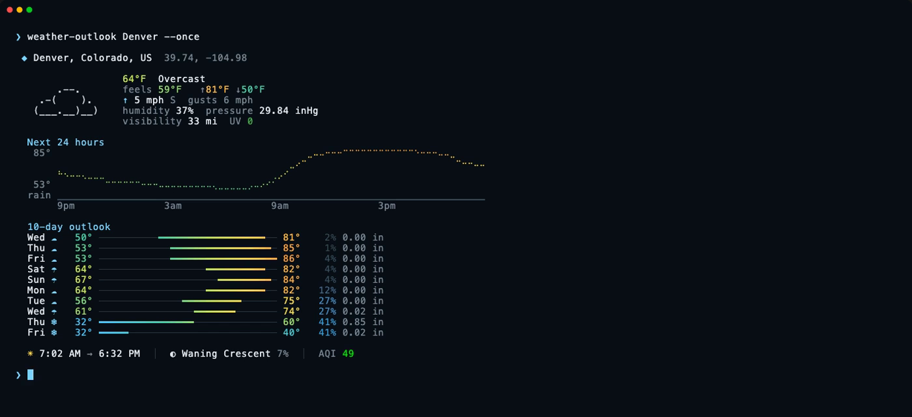

And the whole planet in one command:

```sh
weather-outlook hazards        # alias: weather-outlook planet
```

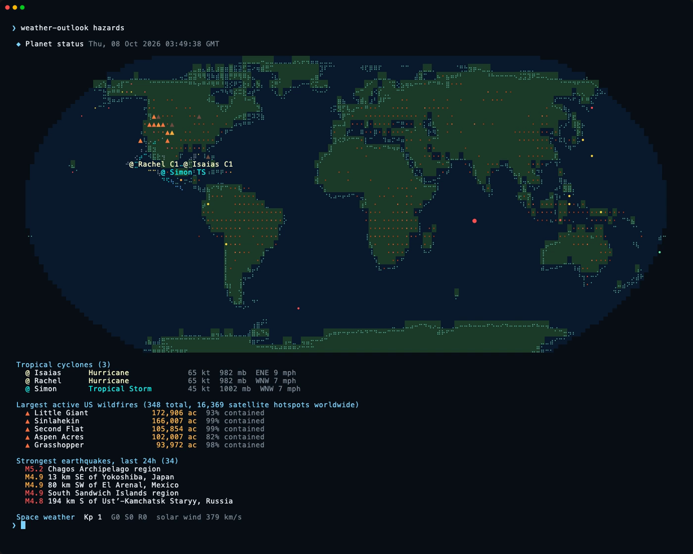

## 🧰 Usage

```text
weather-outlook [location | @saved] [options]
weather-outlook hazards [--json] [--no-hotspots]
weather-outlook add <name> <place>          # save a location, then use it as @name
weather-outlook config <get|set|unset|path> [key] [value]
weather-outlook doctor                      # terminal + provider diagnostics
weather-outlook cache <clear|path|prune>
```

| Option | |
| --- | --- |
| `location` | City (`Paris`, `Paris, TX`, `London, UK`), postcode (`10001`), `lat,lon`, or a saved `@name`. Omit to use your IP location. Ambiguous names (`Springfield`) prompt you to pick when run interactively; `--no-pick` takes the best match. |
| `-1, --once` | Print a one-shot summary instead of opening the dashboard (adapts to narrow terminals) |
| `-c, --compact` | Five-line card, great for a shell rc file |
| `-f, --format <fmt>` | One-liner for status bars, e.g. `'%c %t %w'` (see below) |
| `-j, --json` | Print the full report as JSON (schema-versioned, stable contract) |
| `--fields <list>` | With `--json`, only these parts: `location,current,hourly,daily,forecast,airQuality,astronomy,alerts,errors` |
| `-u, --units <metric\|imperial>` | Override units (default: config, else the location's country) |
| `--temp <C\|F>` · `--wind <kmh\|mph\|ms\|kn\|bft>` · `--precip <mm\|in>` | Per-measure units on top of `--units` (`bft` = Beaufort) |
| `--hour12` · `--hour24` | Clock style (default: from your locale) |
| `--simulate <rain\|snow\|storm\|fog\|clear\|cloudy>` | Force the sky animation — great for demos |
| `--no-motion` | Disable animations (also `WEATHER_OUTLOOK_REDUCE_MOTION=1`) |
| `--no-color` | Disable colors (also respects `NO_COLOR`) |
| `-r, --refresh` | Bypass the response cache |
| `--images <auto\|off>` | Radar as Kitty/Sixel images when supported, or `off` for text cells (also `WEATHER_OUTLOOK_IMAGES=off`) |
| `about` | Version, data providers, licenses and attribution |

### Keys

| Key | Action |
| --- | --- |
| <kbd>1</kbd>–<kbd>7</kbd> · <kbd>Tab</kbd> | Now · Hourly · 10-Day · Radar · World Map · Hazards · Alerts |
| <kbd>u</kbd> | Toggle °C / °F |
| <kbd>r</kbd> | Refresh now |
| <kbd>m</kbd> | Toggle animations |
| <kbd>←↑↓→</kbd> / <kbd>h j k l</kbd> | Pan the map |
| <kbd>+</kbd> / <kbd>-</kbd> | Zoom the map or radar |
| <kbd>c</kbd> · <kbd>0</kbd> | Center on your location · reset the map |
| drag · wheel | Pan the map · zoom around the pointer |
| <kbd>S</kbd> <kbd>F</kbd> <kbd>H</kbd> <kbd>Q</kbd> <kbd>A</kbd> | Map layers: storms · fires · hotspots · quakes · alerts |
| <kbd>T</kbd> <kbd>W</kbd> <kbd>P</kbd> <kbd>C</kbd> | Map fields (one at a time, with legend): temperature · wind · precipitation · clouds |
| <kbd>N</kbd> <kbd>O</kbd> <kbd>L</kbd> | Map overlays: night shading · aurora oval · city names |
| <kbd>g</kbd> | Map: type a place and fly there |
| <kbd>i</kbd> / click | Map: inspect hazards — <kbd>Tab</kbd> next, <kbd>Enter</kbd> open its forecast, <kbd>Esc</kbd> exit |
| <kbd>Space</kbd> · <kbd>,</kbd> <kbd>.</kbd> | Radar play/pause · step frames |
| <kbd>i</kbd> (radar) | Radar: real image ↔ text cells |
| <kbd>v</kbd> | Radar: satellite base layer (GOES / Himawari / VIIRS via NASA GIBS) |
| <kbd>!</kbd> | Data credits for this session |
| <kbd>?</kbd> · <kbd>q</kbd> | Help · quit |

### JSON for scripts

```sh
weather-outlook "Reykjavik" --json | jq '.forecast.current | {temperature, condition, windSpeed}'
weather-outlook Denver --json --fields current,alerts   # only fetches what you ask for
weather-outlook hazards --json | jq '.storms[] | {name, category, windKt}'
```

The output is a stable, versioned contract described by JSON Schema: [`schema/report.v1.json`](schema/report.v1.json) and [`schema/hazards.v1.json`](schema/hazards.v1.json). Every document carries `schemaVersion`; values are always metric/SI (°C, km/h, mm, hPa, metres) whatever `--units` says, and times are ISO 8601 with offsets. Breaking changes bump the version and get a new schema file.

### Status bars

`--format` takes wttr.in-style tokens and only fetches what they need (`%l %m %S` makes no forecast request at all). It answers from cache instantly and refreshes the cache in the background.

```sh
weather-outlook Denver --format '%c %t %w'      # ☁ 64°F ↑6mph
```

| Token | | Token | |
| --- | --- | --- | --- |
| `%c` | condition glyph | `%p` | chance of precipitation |
| `%C` | condition text | `%a` | US AQI |
| `%t` | temperature | `%m` | moon phase |
| `%f` | feels like | `%S` · `%s` | sunrise · sunset |
| `%h` | humidity | `%A` | active alert count |
| `%w` | wind | `%l` | location name |

### Config

Settings live in `~/.config/weather-outlook/config.json` (`%APPDATA%` on Windows; `weather-outlook config path` prints it, `WEATHER_OUTLOOK_CONFIG` overrides it):

```sh
weather-outlook config set units metric
weather-outlook config set wind kn          # temp, wind, precip, clock (12h|24h), theme
weather-outlook config set keys.OWM_API_KEY …
weather-outlook add home "Paris, TX"
weather-outlook @home
```

```json
{ "units": "imperial", "wind": "kn", "theme": "midnight", "locations": [{ "name": "home", "query": "Denver" }], "keys": { "OWM_API_KEY": "..." } }
```

Precedence is flags › environment › file › defaults. `WEATHER_OUTLOOK_UNITS`, `_TEMP`, `_WIND`, `_PRECIP`, `_CLOCK` and `_THEME` override the file, and a provider key in the environment (e.g. `OWM_API_KEY`) beats the one in `keys`.

### Troubleshooting

`weather-outlook doctor` prints the detected color depth, unicode support, image protocol and terminal size, the config and cache locations (with cache size), pings every data source with latency, and draws a braille / block / emoji test pattern so you can see what your font supports.

## 🛰️ Data sources

Everything works out of the box — no accounts, no keys. Responses are cached on disk and served stale if you go offline.

| Data | Source | Coverage |
| --- | --- | --- |
| Forecast, air quality, geocoding | [Open-Meteo](https://open-meteo.com) (CC BY 4.0) | 🌐 Global |
| Weather alerts | [NWS](https://www.weather.gov/documentation/services-web-api) | 🇺🇸 US |
| Hurricane tracks & cones | [NOAA NHC](https://www.nhc.noaa.gov) via NOAA map services | Atlantic & Pacific |
| Tropical cyclones elsewhere | [GDACS](https://www.gdacs.org) | 🌐 Global |
| Wildfire incidents | [NIFC WFIGS](https://data-nifc.opendata.arcgis.com) | 🇺🇸 US |
| Satellite fire hotspots | [NASA FIRMS](https://firms.modaps.eosdis.nasa.gov) (MODIS, 24h) | 🌐 Global |
| Earthquakes | [USGS](https://earthquake.usgs.gov/earthquakes/feed/) | 🌐 Global |
| Space weather & aurora | [NOAA SWPC](https://www.swpc.noaa.gov) | 🌐 Global |
| Radar | [RainViewer](https://www.rainviewer.com/api.html) · [IEM NEXRAD](https://mesonet.agron.iastate.edu) (inside the US) | 🌐 Global · 🇺🇸 US |
| Satellite | [NASA GIBS](https://earthdata.nasa.gov/gibs): GOES-East/West GeoColor, Himawari IR, VIIRS | 🌐 Global |
| Base map | [Natural Earth](https://www.naturalearthdata.com) via world-atlas | Public domain |
| Sun & moon | Computed locally with [SunCalc](https://github.com/mourner/suncalc) | — |

Planned next: MeteoAlarm & Environment Canada alerts, SPC outlooks, tides & buoys, model comparison, and optional keyed providers — see the [roadmap](https://github.com/cport1/weather-outlook/milestones).

## 🖥️ Terminal support

Any modern truecolor terminal whose font includes braille glyphs will look great. Terminals that speak the **Kitty graphics** or **Sixel** protocols render radar as real images — detected automatically by querying the terminal, never guessed from environment variables. Recorders like VHS/ttyd advertise Sixel without rendering it; pass `--images off` (or set `WEATHER_OUTLOOK_IMAGES=off`) to force text cells. Fewer colors, no unicode, or `NO_COLOR` all degrade gracefully.

## 🛠️ Development

```sh
git clone https://github.com/cport1/weather-outlook && cd weather-outlook
bun install
bun dev Miami              # run the dashboard from source
bun test                   # unit tests + a real-PTY boot test of the built CLI
bun run typecheck && bun run lint
bun run schema             # regenerate schema/*.json after changing src/domain/types.ts
bun run fixtures           # re-record test/fixtures from the live APIs
```

Built with [OpenTUI](https://github.com/anomalyco/opentui) + Solid, TypeScript, d3-geo, zod and citty. Handy tools:

- `HTML=out.html VIEW=map bun scripts/snapshot.tsx Miami 150 42` — render any view headlessly to colored HTML
- `vhs docs/tapes/hero.tape` — re-record the README media with [VHS](https://github.com/charmbracelet/vhs)

Releases are automatic: [Conventional Commits](https://www.conventionalcommits.org) on `master` feed a release PR, and merging it publishes to npm with provenance.

## 📜 License

[MIT](LICENSE) © Chris Portscheller
